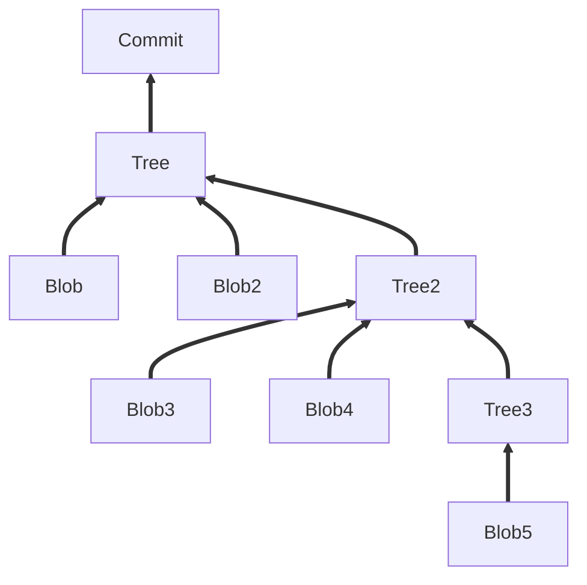
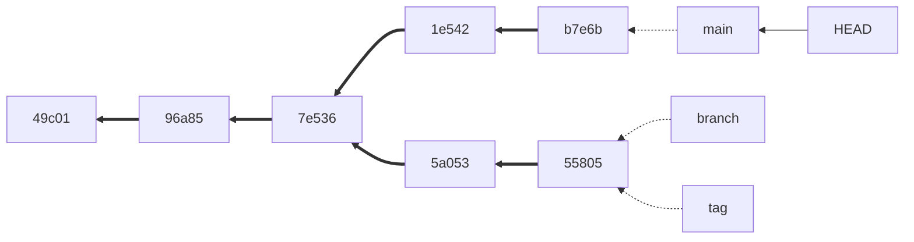

# Deep dive into git

This is the demo repo for a hands-on lab for working with git from the command line.

## Before you start

### Check yor git installation

Make sure git is installed and the version is > 2.23:

```console
$ git --version
> git version 2.35.1
```

If not, [download](https://git-scm.com/downloads) and install git.

### Check your git config

1. Check your name and email address:

```console
$ git config --global user.name
$ git config --global user.email
```

If this does not return the desired values, set the config using these commands:

```console
$ git config --global user.name '<your_name>'
$ git config --global user.email '<your_email_address>'
```

2. Set the default branch to `main`:

```console
$ git config --global init.defaultBranch main
```

3. Check your default editor

Check your default editor (i.e. by running `git config --global --edit`). If you like the editor, then you are good. If your stuck in vim (click <kbd>ESC</kbd> <kbd>:</kbd> <kbd>q</kbd> <kbd>!</kbd> <kbd>Enter</kbd> to exit), then configure the editor of your choice - for example CSCode:

```console
$ git config core.editor 'code --wait'
```

## Exercise 1: Understanding git

### Set-up:
Create a local file/folder:

```console
$ mkdir UnderstandingGit
$ cd UnderstandingGit
$ mkdir folder;
$ for d in {1..6}; do echo  "Line ${d}" >> folder/file.txt; done;
```

### Exercise

1. Modify the file and verify its SHA value (`git hash-object`)
2. Initialize the git repo (`git init`) and check the changes in your folder.
3. Add file to index (`git add`).
4. Commit file and check in your `.git` folder what a commit is (`git cat-file` and `git ls-tree`).
5. Add another commit and verify how the two commits are connected.

<details>
  <summary>Important commands for this exercise:</summary>

```
$ git hash-object folder/file.txt
$ git init
$ git add
$ git commit
$ git ls-tree
$ git cat-file [-p | -t]
$ cat
```
</details>
  
A commit is a tree of blobs and trees:


  
The commits are connected to their parent commits (DAG):
  


Working with patches:

1. Check how git generates diffs (`git diff`).
2. Create patches for your two commits (`git format-patch`).
3. Undo your changes (`git reset`).
4. Apply the patches (`git apply` and `git am`).


<details>
  <summary>Important commands for this exercise:</summary>

  ```console
  $ git diff
  $ git format-patch HEAD~2..HEAD
  $ git reset --hard HEAD~2
  $ git apply
  $ git am
  ```
  
</details>
  
## Exercise 2: Working with your local history

### Set-up:

Create a local history:

```console
$ mkdir WorkingWithYourHistory
$ cd WorkingWithYourHistory
$ git init
$ for d in {1..6}; do touch "file${d}.md"; git add "file${d}.md"; git commit -m "adding file ${d}"; done
```

Look at you history. Create a git alias so that you don't have to type the long command all the time.

```console
$ git log --oneline --graph --decorate --all
$ git config --global alias.lol 'log --oneline --graph --decorate --all'
```

### Exercise

1. Add another file (`File7.md`) and ammend it to te last commit.
2. Reset the last two commits and commit them together as a new commit (`git reset --soft`).
3. Reset the last commit and create tree commits out of it (`git reset --mixed`).
4. Undo the last three commit (`git reset --hard`).
5. Cherry pick the changes from the reflog.
6. Do an interactive rebase. Reword commit 2 and edit commit 3. 

<details>
  <summary>Important commands for this exercise:</summary>
  
  ```console
  $ git commit --amend
  $ git reset [--hard | --soft | --mixed]
  $ git reflog
  $ git cherry-pick
  $ git rebase [-i]
  ```
  
</details>

## Practice 3: Finding bugs and adding patches

### Set-up:

```console
$ git clone https://github.com/wulfland/DeepDive.git DeepDive
$ cd DeepDive
```

<details>
  <summary>Important commands for this exercise:</summary>
  
  ```console
  $ git bisect start 
  $ git bisect good <SHA>
  $ git bisect bad <SHA>
  $ git bisect start <GOOD> <BAD>
  $ git bisect run ls index.html
  $ git add -p
  ```
</details>
