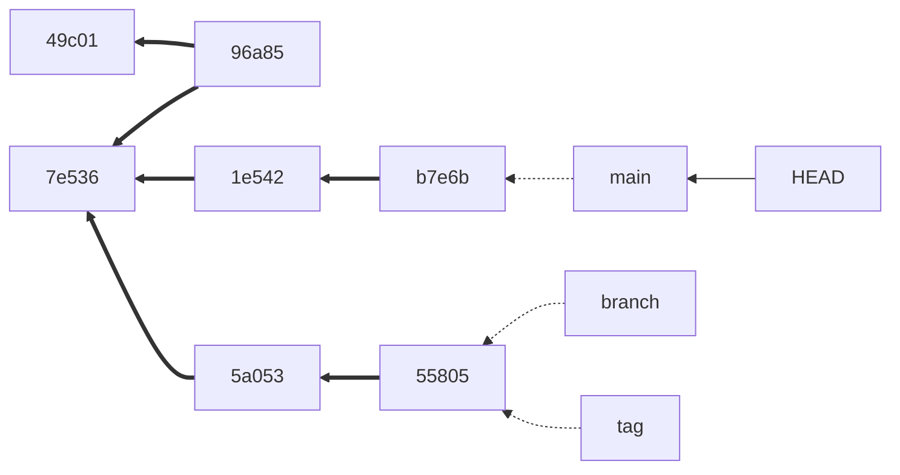
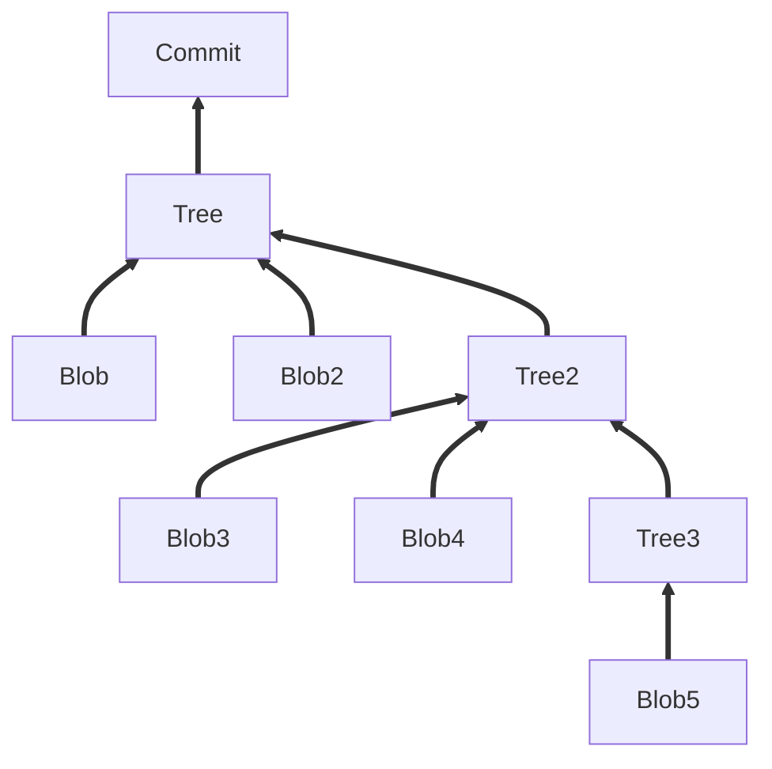

# Deep dive into git

This is the demo repo for a hands-on lab for working with git from the command line.

## Before you start

### Check yor git installation

Make sure git is installed and the version is > 2.23:

```console
$ git --version
> git version 2.35.1
```

If not, [download](https://git-scm.com/downloads) and install git.

### Check your git config

1. Check your name and email address:

```console
$ git config --global user.name
$ git config --global user.email
```

If this does not return the desired values, set the config using these commands:

```console
$ git config --global user.name '<your_name>'
$ git config --global user.email '<your_email_address>'
```

2. Set the default branch to `main`:

```console
$ git config --global init.defaultBranch main
```

3. Check your default editor

Check your default editor (i.e. by running `git config --global --edit`). If you like the editor, then you are good. If your stuck in vim (click <kbd>ESC</kbd> <kbd>:</kbd> <kbd>q</kbd> <kbd>!</kbd> <kbd>Enter</kbd> to exit), then configure the editor of your choice - for example CSCode:

```console
$ git config core.editor 'code --wait'
```

## Understanding git

Create a local file/folder:

```console
$ mkdir folder;
$ for d in {1..6}; do echo  "Line ${d}" >> folder/file.txt; done;
```
Check the HASH of the file:

```
$ git hash-object folder/file.txt
```

<details>
  <summary>Important commands for this exercise:</summary>

```
$ git init
$ git add
$ git commit
$ git ls-tree
$ git cat-file [-p | -t]
$ cat
```
</details>
  
The commit tree:
  


A commit:



